# SurveyAnalytics · Survey analysis that knows when to stay quiet

<p align="center">
  
</p>

A survey closes and the institution is left with a CSV export. Their tool told
them **68% chose "Agree"** and stopped there. Nobody can answer the questions
that actually matter: *which respondents who chose X also chose Y?*, *are there
distinct profiles among the people who answered?*, *which questions divide the
room?*

This repository is the analysis that comes after the percentages — and, just as
importantly, **the refusal to report one when the data does not support it.**

---

## Project status

| Indicator | Status |
|---|---|
| **Continuous integration** | [](https://github.com/alexander-tinoco/Survey-Analitics/actions/workflows/ci.yml) |
| **License** | [](LICENSE) |
| **Tests** | **383**, of which **211** cover the analysis engine alone |
| **Coverage** | **98.6%** overall · **100%** on `apps/analytics/engine/`, enforced as its own CI stage |
| **Routes** | 34 across HTML pages and a versioned `/api/v1/` |
| **Pipeline** | GitHub Actions · a Jenkinsfile that runs the same commands ([docs/CI.md](docs/CI.md)) |
| **Governance** | Conventional Commits · SSH-signed · [ADRs](docs/adr/) · [ROADMAP](docs/ROADMAP.md) |

---

## The problem, concretely

What a survey tool gives you, and what this does instead:

| | A survey tool's results tab | This |
|---|---|---|
| **Per question** | Counts and a bar chart | Distributions, participation, and which question people avoided |
| **Between questions** | Nothing | Every pair cross-tabulated, ranked by strength of relationship |
| **Between respondents** | Nothing | Profiles, described by the answers that set them apart |
| **The output** | Charts you interpret yourself | Sentences, with the figures behind each one |
| **On weak data** | The same confident chart | **Nothing, and it says why** |
| **Ordinal scales** | Alphabetical | In scale order — recognized in English *and* Spanish |
| **Re-uploading** | Overwrites the old results | A new version; earlier results stay valid for their data |

Against the included sample of 200 respondents, it reports:

> **50.6%** of respondents who answered "Ingeniería" to "Departamento" also
> answered "Muy de acuerdo" to "Estoy satisfecho con mi puesto" — against
> **16.7%** across everyone.

Against 60 respondents of random answers, it reports **nothing at all**, and
says so. That second behaviour is the harder one to build and the reason the
first can be trusted.

---

## Architecture

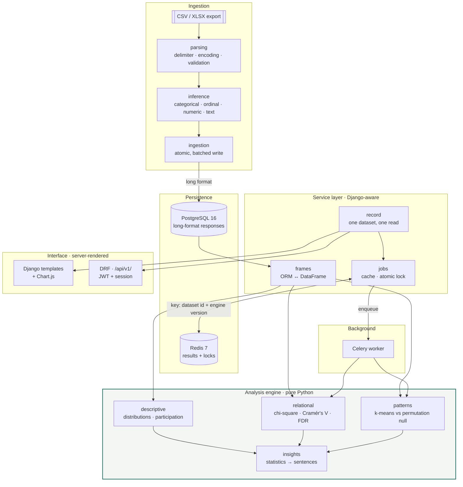

The **engine imports no Django**. Not the ORM, not settings, not the framework
at all — only pandas, scipy and scikit-learn. A DataFrame goes in, a frozen
dataclass comes out, and it performs no I/O
([ADR 0001](docs/adr/0001-framework-agnostic-analytics-engine.md)).

That is not tidiness. It is what makes a statistical test checkable against a
number computed by hand:

```python
rows, columns = build({("Unsatisfied", "Low"): 40, ("Satisfied", "High"): 45})
result = associate("Satisfaction", "Support", rows, columns)
assert result.chi_square == pytest.approx(5.3333)
```

The engine's 211 tests run without a database. That is why a 100% coverage
requirement on it is reasonable rather than performative: reaching it is cheap.

A test walks the engine package with `ast` and fails the build if any module
imports a framework. It was verified by temporarily adding such an import and
watching it fail — a guard that has never failed is not known to work.

---

## Data model

A survey export arrives **wide**: one row per person, one column per question,
and every survey has different columns. Storing that shape directly makes the
database schema depend on the uploaded file.

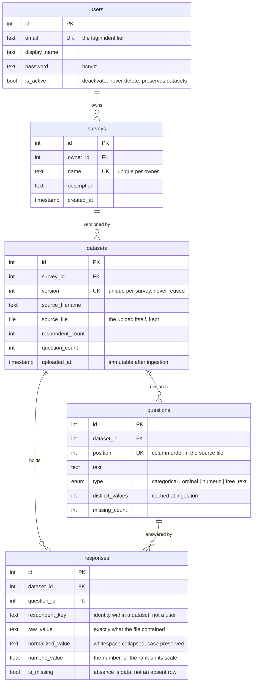

Three alternatives were weighed and two rejected
([ADR 0002](docs/adr/0002-long-format-response-storage.md)):

| Approach | Why not |
|---|---|
| A wide table per dataset | Requires creating tables at runtime; migrations stop meaning anything |
| A JSON blob per respondent | Every question becomes an unindexed key, and the database cannot enforce that an answer refers to a question that exists |
| **Long format** ✅ | One fixed schema serves every survey |

The cost is real — `respondents × questions` rows — but adding a question to
next year's wave becomes an `INSERT` rather than a migration.

**Datasets are immutable and versioned**, and that single decision is what makes
the analytics cache safe: re-uploading produces a *new* id, so a key containing
that id can never serve results computed from data the user has replaced. There
is no invalidation step to forget.

---

## Statistical honesty

This is what defines the project. A chi-square returns a plausible number for
any two columns, and most tools print it.

### Three guards, built into the engine rather than left to the reader

**1 · Expected-count validity (Cochran's rule).** Chi-square approximates a
distribution that only holds when expected cell counts are large enough. Below
that, the p-value does not mean what it appears to. The result is shown, but
never reported as significant — no matter how small its p-value.

```python
if not self.is_reliable:
    return False   # never significant, however small the p
```

**2 · Effect size beside significance.** With enough respondents, a trivial
association becomes "significant". Cramér's V runs 0–1 independently of sample
size, and is what results are ranked by. It is reported in words —
*negligible · weak · moderate · strong* — because "V = 0.21" tells a reader
nothing.

**3 · Correction for multiple comparisons.** Twenty questions make 190 pairs; at
p < 0.05 roughly ten look significant by chance alone. Benjamini-Hochberg
corrects across the whole family. FDR rather than Bonferroni, because this is
exploratory analysis, where missing a real pattern costs more than one false
lead.

### The clustering problem, and the null it is tested against

k-means *always* returns clusters. Give it pure noise and it hands back six tidy
groups with labels. A test written to assert "noise produces no groups" **failed
on the first run**: random categorical answers reached a silhouette of 0.30,
twice the threshold that looked reasonable — because one-hot encoding places
respondents on the vertices of a hypercube, where genuine *geometric* separation
exists without any *population* structure.

A fixed threshold cannot tell those apart. So the observed score is compared
against the same data with **each question's answers shuffled independently**,
which destroys every relationship between questions while preserving each
question's own distribution:

| Dataset | Null (max) | Observed | Verdict |
|---|---|---|---|
| Pure noise | 0.3134 | 0.3009 | **rejected** |
| Real structure with noise | 0.6207 | 0.7664 | accepted |
| Cleanly planted groups | 0.7085 | 1.0 | accepted |

The null scales with each dataset's own shape. A constant cannot.

### Polarized is not the same as divided

Answers spread evenly across a scale describe a population that **has not
settled**. Answers piled at both ends and avoiding the middle describe one
**split into camps**. Only the second is called polarized — calling the first
one polarized would invent a conflict that is not there.

---

## The interface

The world is a **bound laboratory notebook** rather than a dashboard, chosen for
one reason: a dashboard has no way to render *"nothing was found"* as anything
but an empty state, and this product withholds findings often enough that its
refusal has to look like a result ([DESIGN.md](DESIGN.md)).

| Landing | Signing in |
| :---: | :---: |
| 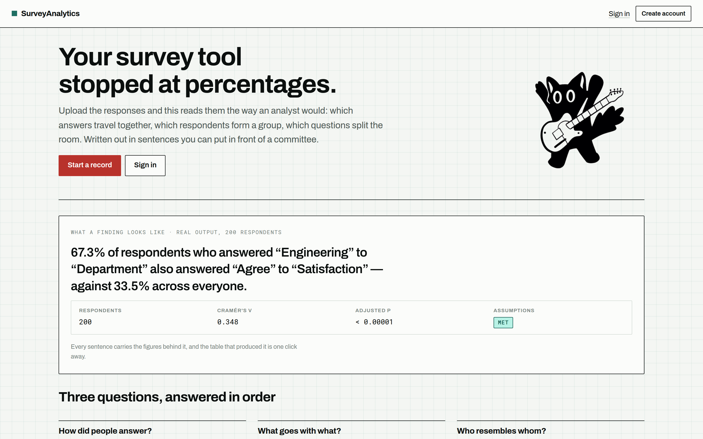 | 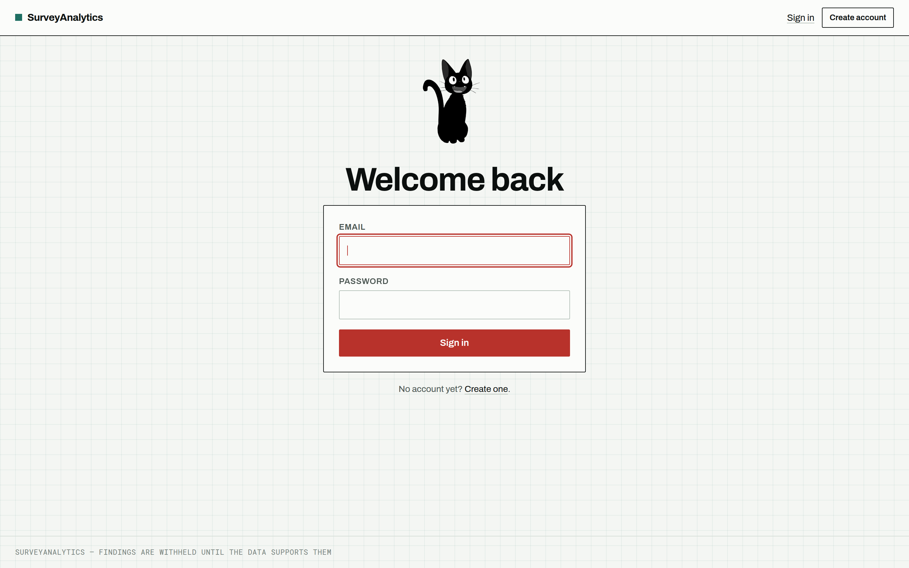 |

The landing shows the product's actual output, rendered by the same components
the record uses — so it cannot drift from the real thing.

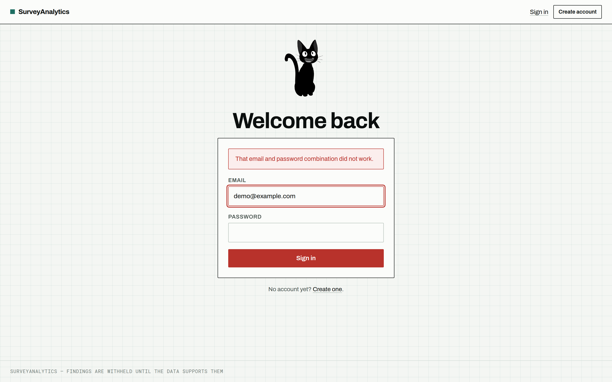

The message does not distinguish "no such account" from "wrong password".
Distinguishing them turns the login form into an oracle for which email
addresses are registered.

| Your records | Starting one |
| :---: | :---: |
| 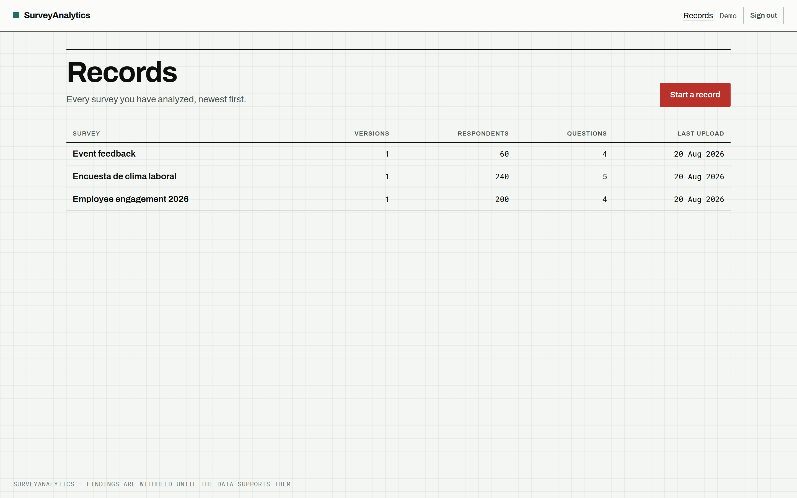 | 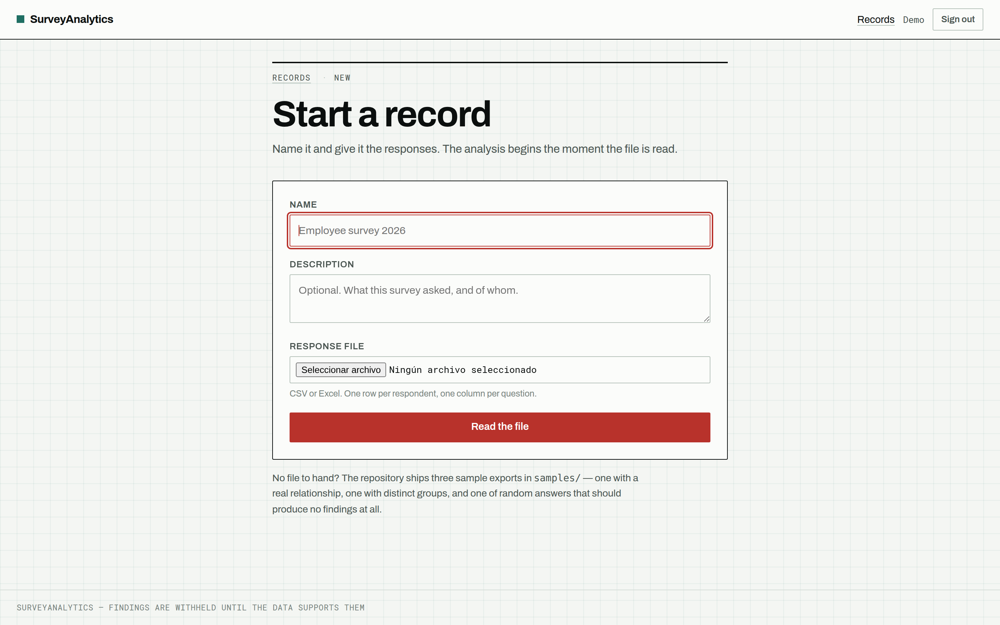 |

Naming a survey and uploading its responses is **one step**. Parsing runs before
the survey is created, so a rejected file cannot strand an empty record the user
then has to find and delete.

### One record, not four pages

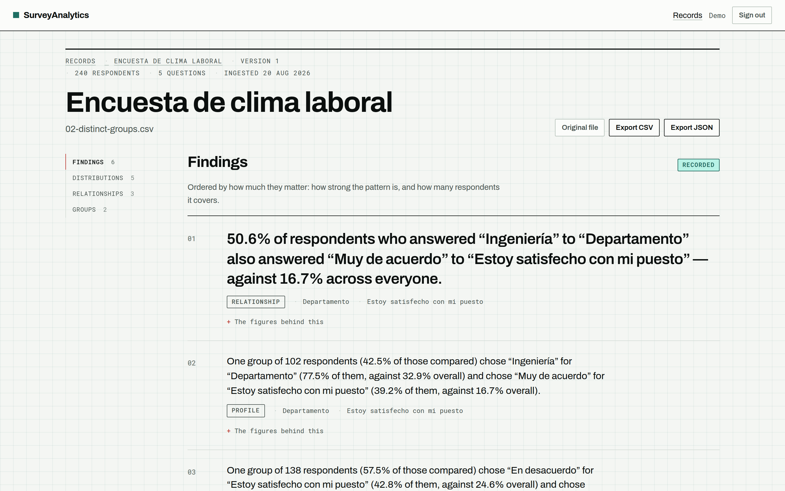

Findings, distributions, relationships and groups live at one URL, with a margin
index that marks the section being read. The first finding is set at headline
scale and the rest recede; the entry header states which record you are inside.

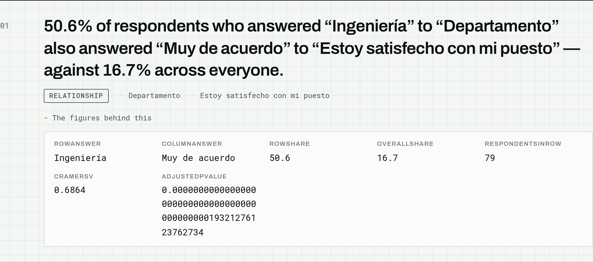

Every sentence carries the figures it was built from. Tests parse the numbers
back out of the generated text and compare them to the stored evidence — a claim
the reader cannot check is a claim they should not trust.

| Distributions | Relationships |
| :---: | :---: |
| 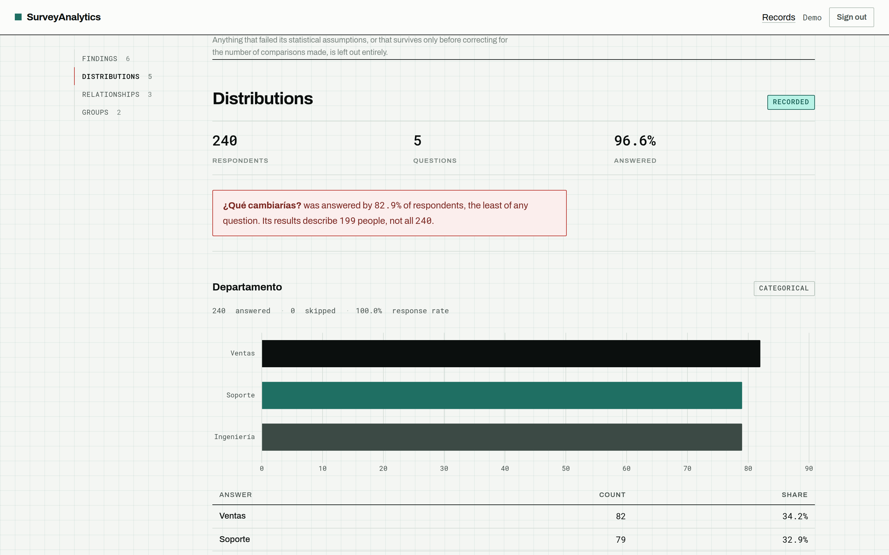 | 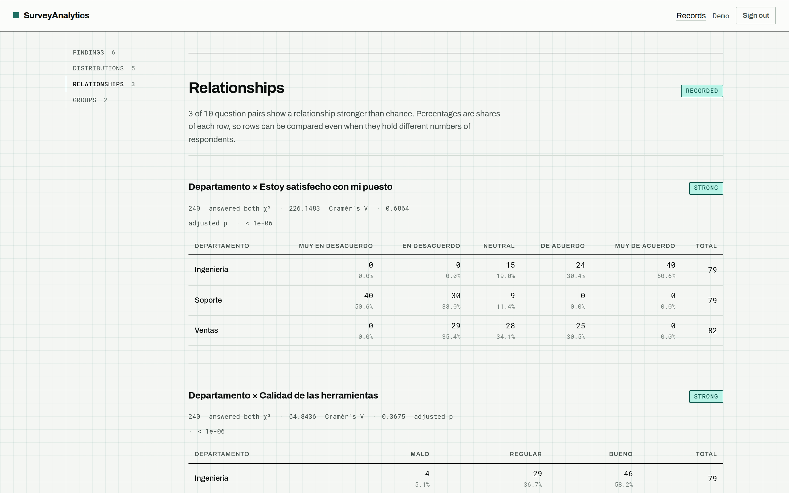 |

Every chart has a table beside it with the same numbers: a canvas is opaque to a
screen reader. Contingency percentages are shares **of each row**, so rows can
be compared even when they hold different numbers of respondents.

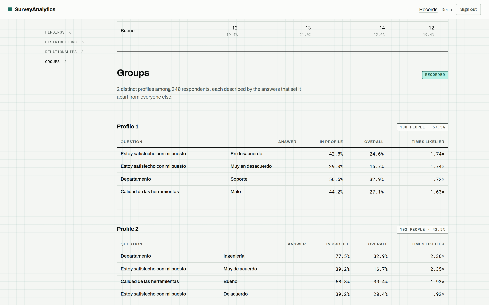

A profile is only reported if it can be *described* — a cluster that holds
together in the encoded space but has no answer setting it apart is not a
finding.

### When there is nothing to report

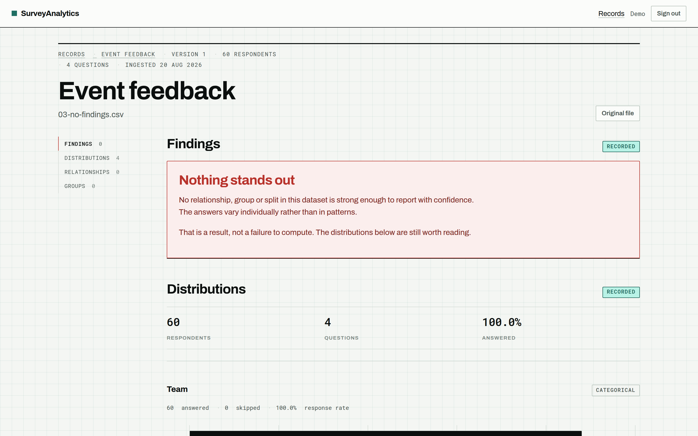

The index reads `FINDINGS 0 · RELATIONSHIPS 0 · GROUPS 0`, and the page states
it as a result rather than greying out. This is the sample file of random
answers, and it is the screen worth looking at first.

<p align="center">
  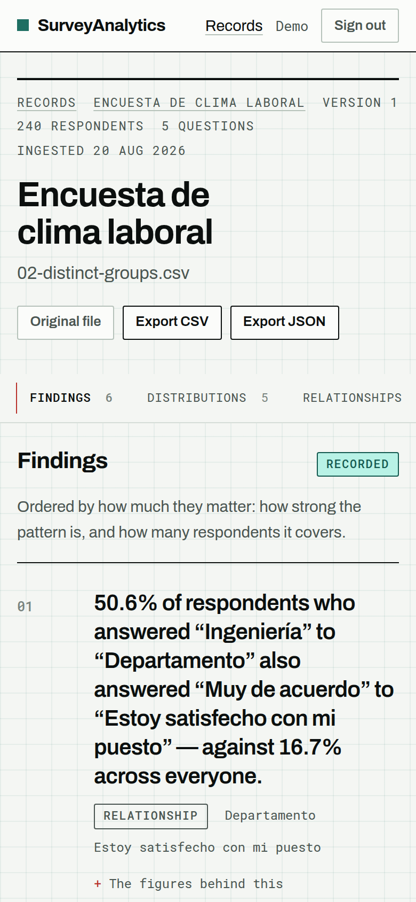
</p>

---

## Running it

Requires Docker and Docker Compose. Python and PostgreSQL run in containers.

```bash
git clone git@github.com:alexander-tinoco/Survey-Analitics.git
cd Survey-Analitics

cp .env.example .env      # development defaults, safe as-is
make build
make migrate
make demo                 # demo account with the three samples loaded
make up
```

The application is at <http://localhost:8000>, with a health check at
`/health/`. Set `WEB_PORT` in `.env` if that port is taken.

### Credentials

`make demo` creates an account and loads all three sample files, so there is
analysis to read on the first page you open:

| | |
|---|---|
| **Email** | `demo@example.com` |
| **Password** | `gato-analitico-99` |

These are development credentials, in a local container, holding synthetic data.
They are published here so the project can be evaluated without a signup, and
they cannot reach production: `load_demo` refuses to run with `DEBUG` off, and
no migration creates them.

### Sample data

Three exports ship in [`samples/`](samples/), each demonstrating a different
outcome:

| File | Respondents | What it shows |
|---|---|---|
| `01-clear-relationship.csv` | 200 | A genuine relationship between department and satisfaction, plus a coffee-preference column constructed to be unrelated — which is correctly rejected |
| `02-distinct-groups.csv` | 240 | Three planted profiles answering **Spanish** Likert scales |
| `03-no-findings.csv` | 60 | Random answers. Produces **no findings at all** |

Upload the third one first.

### Common commands

```bash
make help           # every target
make test           # pytest with the 85% gate
make test-engine    # the engine at its stricter 100% gate
make lint           # ruff check + format check
make worker-logs    # follow the Celery worker
make worker-reload  # Celery does not hot-reload; restart after editing a task
make ci-up          # a local Jenkins server (docs/CI.md)
make clean          # stop everything and drop the database volume
```

---

## Repository layout

```text
Survey-Analitics/
├── docker-compose.yml           → Self-contained stack (what CI builds)
├── docker-compose.override.yml  → Adds the dev bind mount, loaded automatically
├── Jenkinsfile                  → Pipeline as code
├── Makefile                     → The same commands CI runs
├── pyproject.toml               → ruff, pytest and coverage configuration
│
├── config/                      → Project configuration
│   ├── settings/                → base · local · production
│   ├── celery.py                → Celery application
│   ├── error_views.py           → 400 / 403 / 404 / 500, keeping real status codes
│   └── views.py                 → Health check that verifies the database
│
├── apps/
│   ├── accounts/                → Custom user model, JWT and session auth
│   ├── surveys/                 → INGESTION
│   │   ├── models.py            → Survey · Dataset · Question · Response
│   │   ├── services/
│   │   │   ├── parsing.py       → PURE: bytes → DataFrame
│   │   │   ├── inference.py     → PURE: column → question type
│   │   │   └── ingestion.py     → The only part that touches the ORM
│   │   └── management/commands/ → load_demo
│   │
│   └── analytics/
│       ├── engine/              → NO DJANGO IMPORTS (ADR 0001)
│       │   ├── descriptive.py   → Distributions, participation, numeric summaries
│       │   ├── relational.py    → Contingency, chi-square, Cramér's V, FDR
│       │   ├── patterns.py      → Clustering vs a permutation null, polarization
│       │   └── insights.py      → Statistics → sentences
│       ├── services/
│       │   ├── frames.py        → ORM ↔ DataFrame, long → wide
│       │   ├── jobs.py          → Cache, atomic lock, job status
│       │   └── record.py        → One dataset, read once
│       ├── tasks.py             → Celery jobs
│       └── exports.py           → CSV and JSON rendering of findings
│
├── templates/                   → Server-rendered pages
├── static/
│   ├── css/record.css           → The whole design system
│   ├── js/record.js             → Index scroll-spy
│   ├── fonts/                   → Self-hosted Archivo and Roboto Mono
│   └── img/                     → The cat illustrations
├── samples/                     → Three demonstration exports
├── tests/                       → 383 tests, mirroring the apps
└── docs/
    ├── adr/                     → Architecture decision records
    ├── ROADMAP.md               → Milestones and their commits
    ├── CI.md                    → The pipeline, and running Jenkins locally
    └── images/                  → Interface screenshots
```

---

## Background work and caching

Cross-tabulating every pair of questions is quadratic: a 30-question survey is
435 chi-square tests. It runs on a Celery worker, and the result is cached.

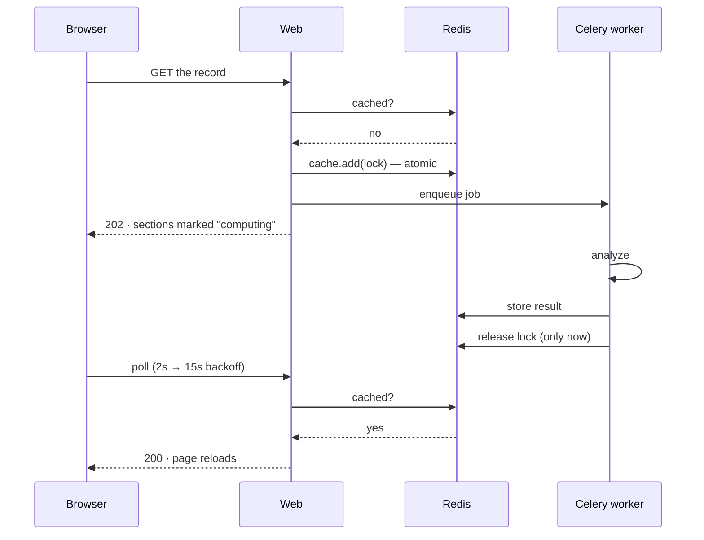

- The key carries the **dataset id and an engine version**. The id makes stale
  results impossible; the version covers the other case, where the data is
  unchanged but the statistics are not.
- The lock uses `cache.add`, atomic in Redis, so two simultaneous visitors
  cannot queue the same job twice.
- It is released **only after** the result is stored, and also on failure, so a
  dead job never leaves a dataset looking permanently busy.
- `202` while working, `200` when ready. A `200` with an empty list would read
  as "finished, found nothing" — indistinguishable from a real result.

---

## API

Versioned under `/api/v1/`, authenticated with JWT or the session cookie the
pages already carry.

| Method | Route | Purpose |
|---|---|---|
| `POST` | `/api/v1/auth/register/` | Create an account |
| `POST` | `/api/v1/auth/login/` | Obtain an access/refresh pair |
| `POST` | `/api/v1/auth/refresh/` | Rotate the pair; the used token is blacklisted |
| `POST` | `/api/v1/auth/logout/` | Blacklist the refresh token |
| `GET` | `/api/v1/auth/me/` | The authenticated user |
| `GET` | `/api/v1/analytics/datasets/<id>/descriptive/` | Distributions and participation |
| `GET` | `/api/v1/analytics/datasets/<id>/relational/` | Associations · `202` while computing |
| `GET` | `/api/v1/analytics/datasets/<id>/patterns/` | Groups and polarization · `202` while computing |
| `GET` | `/api/v1/analytics/datasets/<id>/insights/` | The findings · `202` until every layer is ready |

Access tokens live 15 minutes; refresh tokens rotate and the used one is
blacklisted, so a stolen refresh token fails on replay rather than granting a
parallel session.

Findings also export as **CSV or JSON** from the record, carrying the evidence
behind each sentence — an exported claim without its figures cannot be checked
once it has left the application. Exporting is refused while a layer is still
computing: a file is read later, with no sign that it was partial when written.

---

## Environment variables

```ini
DJANGO_SETTINGS_MODULE=config.settings.local
DJANGO_SECRET_KEY=...          # no default: a misconfigured deploy fails at boot
DJANGO_DEBUG=True              # defaults to False; the insecure mode is never accidental
DJANGO_ALLOWED_HOSTS=localhost,127.0.0.1

POSTGRES_DB=surveyanalytics
POSTGRES_USER=surveyanalytics
POSTGRES_PASSWORD=surveyanalytics
DATABASE_URL=postgres://surveyanalytics:surveyanalytics@db:5432/surveyanalytics

REDIS_URL=redis://redis:6379/0 # cache and Celery broker

WEB_PORT=8000                  # host port, in case 8000 is taken
JENKINS_PORT=8080              # only for the optional local CI server
```

`production.py` additionally forces HTTPS redirects, secure cookies, HSTS for a
year, `X-Frame-Options: DENY` and MIME-sniffing protection. Those settings only
take effect on a deployed instance — which means a mistake in them is invisible
during development — so **they have their own tests**, asserting each guarantee
with a docstring naming the attack it prevents.

---

## Quality

```bash
make test           # 383 tests, 85% floor
make test-engine    # the engine alone, 100% floor
```

Statistical functions are tested against values computed by hand and written
into the docstring:

```python
def test_statistic_matches_the_hand_computed_value(self):
    """Table:
               B1   B2  | total
        A1     10   20  |   30
        A2     30   20  |   50
        total  40   40  |   80

    chi2 = (10-15)²/15 + (20-15)²/15 + (30-25)²/25 + (20-25)²/25
         = 1.6667 + 1.6667 + 1 + 1 = 5.3333
    """
```

Deriving the expected value with the same library the code uses would only prove
pandas agrees with itself — a wrong formula would pass. Written by hand, it
fails.

There are more lines of test than of application code (4,822 vs 4,643), which is
deliberate for a project whose failure mode is not a crash but a confident wrong
answer.

Both pipelines run lint, the full suite, and the engine's stricter gate.
[`docs/CI.md`](docs/CI.md) records what running the Jenkins pipeline for the
first time turned up — including two application bugs that local development
could not reveal, one of them a container that could not write inside its own
working directory.

---

## Architecture decisions

| ADR | Decision |
|---|---|
| [0001](docs/adr/0001-framework-agnostic-analytics-engine.md) | The analytics engine imports no framework |
| [0002](docs/adr/0002-long-format-response-storage.md) | Responses are stored long, in immutable versioned datasets |

Records are immutable: a decision that stops being true is superseded by a new
ADR that links back, never edited. The reasoning is the asset — "why we did not
do X" is what stops someone reintroducing X.

---

## Known limitations

What this explicitly does **not** do today:

- **No public deployment.** The stack is defined and runs locally; there is no
  hosted environment, so the screenshots above are the only way to see it
  without cloning.
- **Everything fits in memory.** Ingestion is capped at 100,000 rows and 500
  columns. Safe at survey scale, not a tool for larger data.
- **Clustering oversegments.** Three planted profiles come back as four.
  Per-question weighting, a parsimony rule and deduplicating identical
  descriptions each reduced it; the remainder is inherent to k-means on
  categorical answers. Every profile is therefore shown with the answers that
  define it, for the reader to judge.
- **Generated findings are English templates.** Ordinal scales and non-answers
  are recognized in Spanish, but the sentences are not translated — so a Spanish
  survey produces a bilingual finding. This is the most visible rough edge left.
- **Free text is stored but never analyzed.** No topic extraction, no sentiment.
  It is excluded from every statistical test on purpose: a cross-tabulation of
  prose is meaningless.
- **No rate limiting**, and no scheduled retention.
- **The 500 page reuses the 400 illustration.** No dedicated cat exists for it.

---

## License

[MIT](LICENSE) · Alexander Tinoco

Every figure in the screenshots, tests and documentation comes from synthetic
data generated by the scripts in [`samples/`](samples/). No real survey response
has ever been part of this repository.
